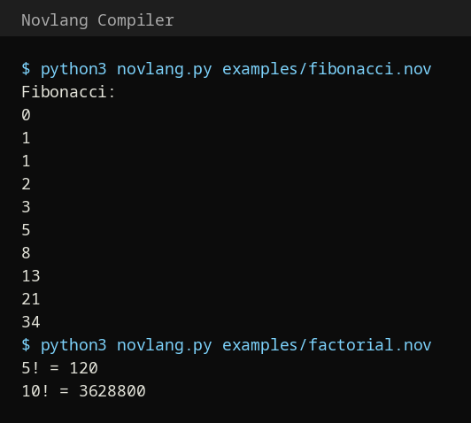

# 🔥 Novlang Compiler

My **Compiler Construction (CC) semester project** — a complete compiler for **Novlang**, a small programming language I designed, built from scratch in Python.

## 🏗️ Compiler Phases

```
Source (.nov) → Lexer → Tokens → Parser → AST → Interpreter → Output
```

| Phase | File | Description |
|---|---|---|
| **Lexical Analysis** | `lexer.py` | Tokenizer: keywords, numbers, strings, operators, comments (`//`, `/* */`) |
| **Syntax Analysis** | `parser.py` | Recursive-descent parser building an Abstract Syntax Tree |
| **Interpretation** | `interpreter.py` | Tree-walk interpreter with lexical scoping & function calls |
| **AST** | `ast_nodes.py` | Node definitions for every statement & expression |

## ✨ Language Features

- 🔤 Variables (`let x = 5;`)
- ➕ Arithmetic: `+ - * / %`, comparisons, logical `&& \|\| !`
- 🖨️ `print()` statements
- 🔀 `if / else` conditionals
- 🔁 `while` loops
- 📦 Functions with parameters & `return` (incl. recursion)
- 💬 String concatenation & comments

## 📁 Project Structure

```
├── novlang.py          # Entry point: python3 novlang.py <file.nov>
├── lexer.py            # Tokenizer
├── parser.py           # Recursive-descent parser
├── ast_nodes.py        # AST nodes
├── interpreter.py      # Tree-walk interpreter
├── examples/           # Sample Novlang programs
│   ├── hello.nov
│   ├── fibonacci.nov
│   ├── factorial.nov
│   └── fizzbuzz.nov
└── screenshots/
```

## ▶️ How to Run

```bash
python3 novlang.py examples/fibonacci.nov
python3 novlang.py examples/factorial.nov
```

No dependencies — pure Python 3!

### Example

```c
// fibonacci.nov
let a = 0;
let b = 1;
let i = 0;

while (i < 10) {
    print(a);
    let temp = a + b;
    a = b;
    b = temp;
    i = i + 1;
}
```

## 📸 Screenshot



## 🛠️ Tech

- Python 3 (no external dependencies)

## 👩‍💻 Author

**Ayesha Shoukat** — Computer Science @ UET Narowal
